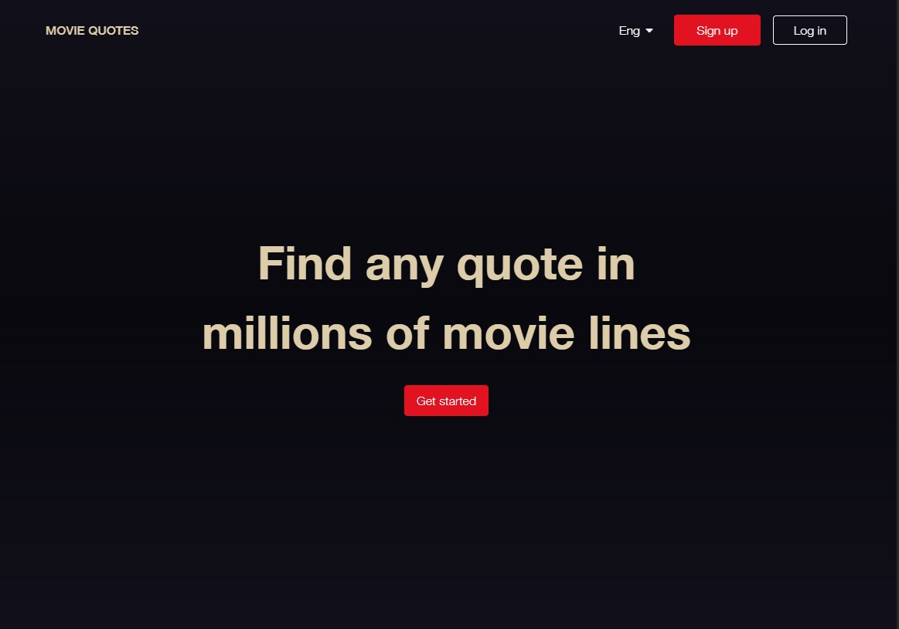

<div style="display:flex; align-items: center">
  <h1 style="position:relative; top: -6px" >Movie Quotes</h1>
</div>

---

### Screenshot



Movie quotes - is a bilingual (Georgian - English) Responsive website where users can first register, then login and view quotes from movies.

After reaching the landing page, the user can complete the registration, after which he activates the account via email, and then he can enter the system. An alternative is Google Authentication.

After authorization, the user has the option to add movies and quotes related to the movie, which will then appear on the newsfeed. The newsfeed has an endless scroll of user-added quotes that can be liked and commented on, after which the author is notified in real-time using websockets.

An authorized user can view the movies and quotes added by him in a separate section or search for those added by others.

It is also possible for the user to update his data and change his password, username and avatar photo. Also reset password if you forget it.

#

### Table of Contents

- [Prerequisites](#prerequisites)
- [Tech Stack](#tech-stack)
- [Getting Started](#getting-started)

### Prerequisites

- _Node JS @20.X and up_
- _npm @10 and up_

#

### API Documentation

The API documentation can be found at the following link:

[API Documentation](https://documenter.getpostman.com/view/28147438/2sAXjQ2W6e#e7fc8f60-147d-4e57-99bc-f854f73a181f)

### Tech Stack

- [React] - Front-end framework
- [Node.js / Express.js] - Back-end
- [MongoDB, mongoose] - Database
- [Tailwind CSS] - CSS framework for styling
- [Typescript] - JavaScript with syntax for types
- [@tanstack/react-query] - To handle API requests
- [React Hook Form] - library for form validation
- [JWT - JSON Web Tokens] - securely connection between two parties
- [Socket.io] - To handle real time notifications
- [Firebase] - To handle Google authentication and image uploading
- [Framer Motion] - Animation library
- [Redux.js/toolkit] - To handle global state
- [React dropzone] - To handle image drag and drop
- [React Lazy Load Image Component] - Optimization
- [React Infinite Scroll Component] - To handle infinite scroll
- [Redux Persist] - Persist and rehydrate a redux store.
- [React Hot Toast] - To handle alert messages
- [Node Mailer] - To handle emails
- [i18Next] - For localization
- [Cookies] - For Authentication

#

### Getting Started

1\. First of all you need to clone repository from github:

```sh
git clone https://github.com/datomaluta/mern-movie-quotes
```

2\. Install all the dependencies

```sh
npm install
```

3\. after that you can run application from terminal:

```sh
npm run dev
```

4\. Next, go to app client directory with this command

```sh
cd client
```

5\. Next step requires install all the dependencies again

```sh
npm install
```

6\. after that you can run application from terminal:

```sh
npm run dev
```

#
